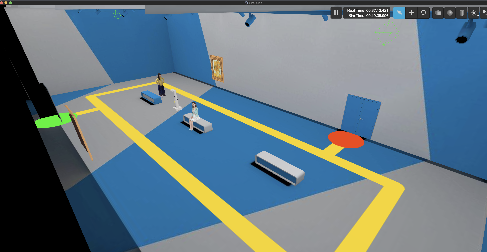

# YOLOv8-Pose Integration with ROS 2 Humble (DeepMind Bot)

This project demonstrates the integration of **YOLOv8-Pose** (State-of-the-Art Pose Estimation) with **ROS 2 Humble** in a Gazebo simulation environment. It features a custom robot ("DeepMind Bot") navigating a museum environment, where the vision system detects human keypoints and calculates kinematic angles in real-time.

## Project Overview

The system consists of the following core components:

* **Simulation:** A Gazebo simulation of the DeepMind Bot in a museum world.
* **Perception:** A ROS 2 node (`yolo_pose_estimation_node`) utilizing Ultralytics YOLOv8-Pose to detect human skeletal keypoints from the robot's camera feed.
* **Visualization:** Integration with Rviz2 for visualizing the robot model, camera stream, and pose estimation results.

## Prerequisites

This project is designed to run on **macOS (Intel/Silicon)**, **Linux** or **Windows wsl** using **Conda (RoboStack)** to manage the ROS 2 environment.

* **Conda:** Miniforge (recommended) or Anaconda installed.
* **Git**

## Installation & Setup

A consolidated script is provided to automate the environment creation, dependency installation, and workspace build.

1. **Clone the Repository:**

   ```bash
   git clone https://github.com/nicanor-korir/Keypoint-Detection-using-YOLO-and-ROS-in-Gazebo
   cd Keypoint-Detection-using-YOLO-and-ROS-in-Gazebo
   ```
2. **Run the Setup Script:**
   This script will create a fresh Conda environment named `ros2_humble_env`, install ROS 2 Humble and all required dependencies (including `ros2_control`, `gazebo_ros`, and `ultralytics`), and build the workspace.

   ```bash
   chmod +x setup_and_launch.sh
   ./setup_and_launch.sh
   ```

   *Note: This process may take 5-10 minutes depending on your internet connection.*

## Usage

### Important Note for macOS Users

⚠️ **macOS Compatibility:** Due to a known issue with Gazebo ROS plugins on macOS/RoboStack, this project uses a simplified launch configuration that bypasses problematic plugins.

**What works:** Gazebo visualization, camera/sensor data, YOLOv8 pose estimation, RViz
**What doesn't work:** Robot joint control via ros2_control (controller_manager)

This limitation does not affect the keypoint detection

### 1. Launching the Simulation

**Optional:** Verify your setup before launching:

```bash
./verify_setup.sh
```

Before launching for the first time, make sure to kill any existing Gazebo processes:

```bash
pkill -9 gzserver; pkill -9 gzclient
```

Launch Gazebo with the museum environment:

```bash
./launch_simulation.sh
```

**What you should see:**

- Gazebo GUI opens with museum environment
- Walls, floor, lighting
- Two person models (for pose detection)
- Paintings on walls
- **No black/dark screen**



**Note:** Robot teleop control is not available on macOS due to missing ros2_control support. This does not affect pose estimation functionality.

### 2. Running Pose Estimation

To start the YOLOv8 perception node, open a **new terminal** and run:

```bash
# 1. Activate the environment
conda activate ros2_humble_env

# 2. CRITICAL: Prevent system Python conflicts
unset PYTHONPATH

# 3. Source the workspace
source ros2_ws/install/setup.zsh  # Use setup.bash if you are on bash

# 4. Run the node
ros2 run advanced_perception yolo_pose_estimation_node
```

### 3. Visualization (Rviz2)
To visualize the results (images with drawn keypoints and markers):

```bash
# (In a new terminal, repeating the activation steps above)
rviz2 -d ros2_ws/src/advanced_perception/rviz/yolo_pose_estimation.rviz
```

At this stage, the deepmind environment, keyboard navigation and rviz should be working and you should get something like this in you local computer


## Repository Structure

```
.
├── setup_and_launch.sh       # Environment setup & workspace build
├── launch_simulation.sh      # Gazebo launcher (macOS-compatible)
├── verify_setup.sh           # Pre-flight checks for setup verification
├── README.md                 # This file
├── screenshots/              # Evidence screenshots
└── ros2_ws/                  # ROS 2 Workspace
    └── src/
        ├── advanced_perception/  # YOLOv8 Node & Logic
        ├── custom_msgs/          # Custom ROS Interfaces (PoseResult.msg, etc.)
        └── deepmind_bot/         # Robot Description & Navigation Stack
```

## Troubleshooting

### Gazebo Issues

* **Black Screen in Gazebo:**

  * First, kill any existing processes: `pkill -9 gzserver; pkill -9 gzclient`
  * Ensure you are using `./launch_simulation.sh` (not manual launch)
  * The script automatically sets required environment variables
  * On macOS, the simplified launch configuration should prevent black screens
* **"Address already in use" Error:**

  ```bash
  pkill -9 gzserver; pkill -9 gzclient
  sleep 2
  ./launch_simulation.sh
  ```
* **"Controller Manager" Error (macOS):**

  * This is expected on macOS - ros2_control plugins crash with RoboStack
  * The project is configured to work without robot control
  * Pose estimation functionality is unaffected

### Python/Build Issues

* **`ImportError: numpy...` / Python Mismatch:**

  * Always run `unset PYTHONPATH` after activating conda environment
  * This prevents ROS 2 from loading incompatible system Python libraries
* **Build Failures:**

  * Clean rebuild:

  ```bash
  cd ros2_ws
  rm -rf build install log
  cd ..
  ./setup_and_launch.sh
  ```

### Verification

To verify your setup is correct:

```bash
# Check conda environment
conda env list | grep ros2_humble_env

# Check if workspace is built
ls ros2_ws/install/

# Test Gazebo directly (should run for a few seconds without crashing)
conda activate ros2_humble_env
unset PYTHONPATH
source ros2_ws/install/setup.bash
gzserver --version
```

### Camera Topics Not Publishing

Check if camera topics exist:

```bash
conda activate ros2_humble_env
source ros2_ws/install/setup.bash
ros2 topic list | grep camera
ros2 topic hz /deepmind_robot1/deepmind_robot1_camera/image_raw
```

### Need Full ros2_control Support?

For projects requiring robot joint control, use:

- **Linux** (Ubuntu 22.04 with ROS 2 Humble native)
- **Docker** with `ros:humble` image
- **WSL2** on Windows

## Credits

This project serves as the final assignment for the "Advanced Robotics Perception" course.

* **Base Robot & Environment:** Provided by [The Construct](https://www.theconstruct.ai/).
* **YOLOv8:** [Ultralytics](https://github.com/ultralytics/ultralytics).
